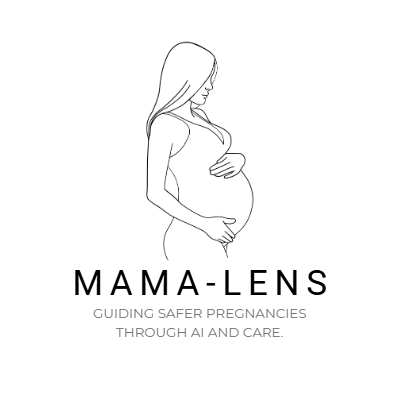

# MAMA-LENS AI
## Maternal Assessment & Monitoring for Early Loss Support

<p align="center">
  
</p>

> An AI-powered maternal healthcare ecosystem designed for Africa-first deployment, combining compassionate care, intelligent risk assessment, and accessible multi-channel support.

---

## Vision

MAMA-LENS AI is a transformative maternal healthcare platform built to reduce maternal mortality, provide emotional support after pregnancy loss, and empower women across underserved African communities through AI-driven, culturally-aware care.

---

## Core Features

| Feature | Description |
|---|---|
| 🧠 AI Risk Assessment | Predicts pregnancy complications, miscarriage risk, preeclampsia, anemia, gestational diabetes |
| 🤖 Digital AI Avatar | Human-like avatar with voice, emotion detection, multilingual support |
| 💚 Emotional Support | Grief support, mental wellness check-ins, depression detection |
| 📱 Multi-Channel Access | Mobile app, WhatsApp, SMS, USSD, Web |
| 🩺 Telemedicine | Video/voice consultations, secure messaging, prescriptions |
| 🗺️ Healthcare Navigation | GIS-based clinic finder, emergency routing, referrals |
| ⌚ IoT/Wearables | Blood pressure, glucose, heart rate, fetal monitoring |
| 🌍 Multilingual | English, Swahili, Sheng, French, Arabic, local languages |
| 📚 Pregnancy Education | Weekly guidance, nutrition, vaccination reminders |
| 🔒 Privacy & Security | HIPAA/GDPR/Kenya DPA compliant, encrypted, consent-managed |

---

## Architecture Overview

```
mama-lens-ai/
├── apps/
│   ├── mobile/          # React Native (Android-first, offline-first)
│   ├── web/             # React + TypeScript + TailwindCSS
│   └── whatsapp-bot/    # WhatsApp Business API integration
├── backend/
│   ├── api/             # FastAPI core backend
│   ├── telemedicine/    # Node.js + LiveKit/WebRTC
│   └── sms-ussd/        # Africa's Talking / Twilio gateway
├── ai/
│   ├── risk-engine/     # Pregnancy risk prediction models
│   ├── emotion-ai/      # Emotion detection & sentiment analysis
│   ├── avatar/          # Digital AI avatar pipeline
│   ├── nlp/             # Multilingual NLP & conversation AI
│   └── recommendation/  # Personalized care recommendations
├── infrastructure/
│   ├── docker/          # Container configurations
│   ├── k8s/             # Kubernetes manifests
│   ├── terraform/       # IaC for AWS/Azure/GCP
│   └── ci-cd/           # GitHub Actions pipelines
├── docs/
│   ├── architecture/    # System diagrams
│   ├── api/             # API documentation
│   ├── business/        # Business model & pitch deck
│   └── compliance/      # Privacy & security docs
└── scripts/             # Setup, migration, seeding scripts
```

---

## Tech Stack

### Frontend
- React 18 + TypeScript + TailwindCSS (Web)
- React Native / Expo (Mobile, Android-first)
- Offline-first with local caching

### Backend
- FastAPI (Python) — Core API, AI inference
- Node.js + Express — Telemedicine, real-time
- PostgreSQL — Primary database
- Redis — Caching, sessions, queues

### AI/ML
- TensorFlow / PyTorch — Risk prediction models
- Hugging Face Transformers — NLP, multilingual
- OpenAI APIs — Conversational AI
- Whisper — Speech-to-text
- ElevenLabs — Text-to-speech
- LiveKit / WebRTC — Real-time communication

### Cloud & Infrastructure
- AWS / Azure / GCP (multi-cloud ready)
- Docker + Kubernetes
- Terraform IaC

---

## Quick Start

```bash
# Clone repository
git clone https://github.com/mama-lens-ai/platform.git
cd mama-lens-ai

# Setup environment
cp .env.example .env
# Edit .env with your configuration

# Start with Docker Compose (development)
docker-compose up -d

# Backend API
cd backend/api
pip install -r requirements.txt
uvicorn main:app --reload

# Frontend Web
cd apps/web
npm install
npm run dev

# Mobile
cd apps/mobile
npm install
npx expo start
```

---

## Compliance

- ✅ HIPAA principles
- ✅ GDPR principles  
- ✅ Kenya Data Protection Act 2019
- ✅ African Union Data Policy Framework
- ✅ WHO maternal health guidelines

---

## License

MIT License — Open for NGO and government healthcare partnerships.

---

*Built with compassion for African mothers. Every feature exists because a real woman needed it.*
