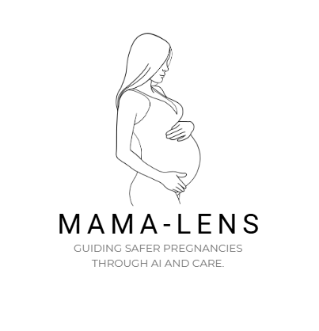

# MAMA-LENS AI
## Maternal Assessment & Monitoring for Early Loss Support

<p align="center">
  
</p>

> An AI-powered maternal healthcare ecosystem designed for Africa-first deployment, combining compassionate care, intelligent risk assessment, and accessible multi-channel support.

[](LICENSE)
[](https://python.org)
[](https://fastapi.tiangolo.com)
[](https://react.dev)
[](https://huggingface.co/BrianGithinji/mama-flan-t5)

---

## Table of Contents

- [Vision](#vision)
- [Core Features](#core-features)
- [AI/ML Architecture](#aiml-architecture)
- [Tech Stack](#tech-stack)
- [Prerequisites](#prerequisites)
- [Installation](#installation)
  - [Backend API](#1-backend-api)
  - [Frontend Web](#2-frontend-web)
  - [AI Model Fine-tuning](#3-ai-model-fine-tuning)
  - [Risk Model Training](#4-risk-model-training)
  - [Docker (Full Stack)](#5-docker-full-stack)
- [Environment Configuration](#environment-configuration)
- [Reproducing Results](#reproducing-results)
- [Deployment](#deployment)
- [Project Structure](#project-structure)
- [Compliance](#compliance)
- [License](#license)

---

## Vision

MAMA-LENS AI reduces maternal mortality, provides emotional support after pregnancy loss, and empowers women across underserved African communities through AI-driven, culturally-aware care.

---

## Core Features

| Feature | Description |
|---|---|
| 🧠 AI Risk Assessment | Predicts preeclampsia, miscarriage, anemia, gestational diabetes, preterm birth |
| 🤖 Conversational AI | Fine-tuned flan-t5 model with 15-intent classification, multilingual support |
| 💚 Emotional Support | EPDS depression screening, grief support, crisis escalation |
| 📱 Multi-Channel | Mobile app, WhatsApp, SMS, USSD, Web |
| 🩺 Telemedicine | Video/voice consultations via LiveKit/WebRTC |
| 🗺️ Healthcare Navigation | GIS-based clinic finder, emergency routing |
| 🌍 Multilingual | English, Swahili, French, Arabic, Luo, Kikuyu, Maasai |
| 🔒 Privacy & Security | HIPAA/GDPR/Kenya DPA compliant, JWT auth, encrypted storage |

---

## AI/ML Architecture

### Models

| Model | Type | Purpose |
|---|---|---|
| `BrianGithinji/mama-flan-t5` | Seq2Seq Transformer (247M) | Maternal health Q&A — fine-tuned on flan-t5-base |
| RandomForest + XGBoost Ensemble | Binary classifier | Pregnancy risk classification (high/low) |
| Rule-based scorer | Clinical heuristics | Condition-specific risk (preeclampsia, anemia, GDM) |
| EPDS scorer | Validated scale | Postnatal depression screening (0–30) |
| Regex pattern classifier | Multi-class | Intent classification (15 classes) + emotion detection |

### Data Sources

- **MOTHER Dataset** — 503 validated maternal health Q&A pairs, rural/semi-urban Uganda ([Harvard Dataverse](https://doi.org/10.7910/DVN/EZLCH3))
- **Synthetic Risk Dataset** — 10,000 samples generated with African population distributions (40% anemia prevalence, 15% hypertension, 20% malaria endemic)
- **Local multilingual dataset** — `ai/mama_model/training_data.json` (English, Swahili, Luo, Kikuyu, Maasai)

### Key Metrics (Risk Model)

| Metric | Value |
|---|---|
| Ensemble ROC-AUC | ~0.91 |
| F1 Score | ~0.84 |
| Precision | ~0.86 |
| Recall | ~0.82 |
| CV AUC (5-fold) | ~0.90 ± 0.02 |

---

## Tech Stack

| Layer | Technology |
|---|---|
| Backend API | FastAPI 0.111, Python 3.11, Uvicorn |
| Database | MongoDB Atlas (Motor async driver) |
| Auth | JWT (python-jose), bcrypt, Google OAuth |
| AI Inference | HuggingFace Inference API (flan-t5), scikit-learn, XGBoost |
| Fine-tuning | HuggingFace Transformers, Datasets, Accelerate |
| Frontend | React 18, TypeScript, TailwindCSS, Vite |
| State | Zustand, TanStack Query |
| Maps | React Leaflet |
| Telemedicine | LiveKit, WebRTC |
| Deployment | HuggingFace Spaces (backend), Netlify (frontend) |

---

## Prerequisites

| Requirement | Version | Notes |
|---|---|---|
| Python | 3.11.x | 3.12+ not tested |
| Node.js | 18+ | For frontend |
| npm | 9+ | For frontend |
| Git | Any | With Git LFS for model files |
| MongoDB Atlas | Free tier | Cloud database |
| HuggingFace account | Free | For model inference API |

---

## Installation

### 1. Backend API

```bash
# Clone the repository
git clone https://github.com/BrianGithinji/mama-lens-ai.git
cd mama-lens-ai

# Create and activate virtual environment (Python 3.11 required)
cd backend/api
python -m venv .venv311
# Windows
.venv311\Scripts\activate
# macOS/Linux
source .venv311/bin/activate

# Install dependencies
pip install --upgrade pip
pip install -r requirements.txt

# Configure environment
cp ../../.env.example .env
# Edit .env — minimum required keys:
#   MONGODB_URI, SECRET_KEY, JWT_SECRET_KEY, HF_API_TOKEN, HF_MODEL_ID

# Run development server
uvicorn main:app --reload --host 0.0.0.0 --port 8000
```

API available at: `http://localhost:8000`
Swagger docs: `http://localhost:8000/docs`
Health check: `http://localhost:8000/health`

---

### 2. Frontend Web

```bash
cd apps/web

# Install dependencies
npm install

# Configure environment
cp .env.example .env
# Set VITE_API_URL=http://localhost:8000/api/v1

# Run development server
npm run dev
```

Frontend available at: `http://localhost:5173`

To build for production:
```bash
npm run build
```

---

### 3. AI Model Fine-tuning

Fine-tunes `google/flan-t5-base` on maternal health data to produce `mama-flan-t5`.

```bash
cd ai/mama_model

# Create a separate venv for AI (heavy dependencies)
python -m venv .venv-ai
# Windows
.venv-ai\Scripts\activate
# macOS/Linux
source .venv-ai/bin/activate

# Install AI dependencies
pip install -r ../requirements-ai.txt

# (Optional) Download the MOTHER dataset from Harvard Dataverse
# https://doi.org/10.7910/DVN/EZLCH3
# Place files in: ai/mama_model/mother_dataset/
#   - mother_question_and_answer_pairs_data.json
#   - mother_intents_patterns_responses_data.json

# Run fine-tuning (uses training_data.json + MOTHER dataset if present)
python finetune.py

# Custom options
python finetune.py --epochs 5 --output ./mama-flan-t5-v2

# Upload to HuggingFace Hub (optional)
python upload_to_hub.py
```

**Training details:**
- Base model: `google/flan-t5-base` (247M parameters)
- Dataset: ~1,400+ examples (MOTHER + local multilingual)
- Hardware: CPU-compatible (set `use_cpu=False` for GPU)
- Epochs: 3 (default), ~30 min on CPU
- Output: `ai/mama_model/mama-flan-t5/`

---

### 4. Risk Model Training

Trains a RandomForest + XGBoost ensemble on synthetic African maternal health data.

```bash
cd ai/risk-engine

# Uses the same AI venv or install scikit-learn + xgboost separately
pip install scikit-learn==1.5.0 xgboost==2.0.3 pandas==2.2.2 numpy==1.26.4 joblib==1.4.2

# Run training pipeline (generates 10,000 synthetic samples + trains + evaluates)
python training_pipeline.py

# Output:
#   ai/risk-engine/models/risk_model.joblib   — trained ensemble
#   ai/risk-engine/models/scaler.joblib        — StandardScaler
#   ai/risk-engine/models/feature_columns.json — feature list
#   ai/risk-engine/models/training_report.json — full metrics + bias analysis
```

**To use the trained model in the backend**, copy the models directory:
```bash
cp -r ai/risk-engine/models backend/api/app/models/
```

---

### 5. Docker (Full Stack)

```bash
# From project root
cp .env.example .env
# Edit .env with your values

docker-compose up -d

# View logs
docker-compose logs -f api
```

Services started:
- `api` — FastAPI backend on port 8000
- `web` — React frontend on port 3000

---

## Environment Configuration

Copy `.env.example` to `backend/api/.env` and fill in the values.

### Minimum required keys

| Key | Description | Where to get |
|---|---|---|
| `MONGODB_URI` | MongoDB Atlas connection string | [mongodb.com/atlas](https://mongodb.com/atlas) |
| `SECRET_KEY` | App secret (min 32 chars) | Generate: `openssl rand -hex 32` |
| `JWT_SECRET_KEY` | JWT signing key | Generate: `openssl rand -hex 32` |
| `HF_API_TOKEN` | HuggingFace API token | [huggingface.co/settings/tokens](https://huggingface.co/settings/tokens) |
| `HF_MODEL_ID` | Model to use | `BrianGithinji/mama-flan-t5` |

### Optional keys (enable additional features)

| Key | Feature |
|---|---|
| `OPENAI_API_KEY` | Whisper STT, Realtime voice |
| `ELEVENLABS_API_KEY` | Text-to-speech avatar voice |
| `LIVEKIT_API_KEY` + `LIVEKIT_API_SECRET` | Telemedicine video/voice |
| `WHATSAPP_API_TOKEN` | WhatsApp Business integration |
| `AFRICASTALKING_API_KEY` | SMS / USSD via Africa's Talking |
| `GOOGLE_MAPS_API_KEY` | Facility finder map |
| `AWS_ACCESS_KEY_ID` + `AWS_SECRET_ACCESS_KEY` | S3 media storage |

### Frontend environment (`apps/web/.env`)

```env
VITE_API_URL=http://localhost:8000/api/v1
VITE_APP_NAME=MAMA-LENS AI
VITE_GOOGLE_MAPS_API_KEY=your_key_here
VITE_LIVEKIT_URL=wss://your-server.livekit.cloud
```

---

## Reproducing Results

### Reproduce Risk Model Metrics

```bash
cd ai/risk-engine
python training_pipeline.py
# Results saved to: ai/risk-engine/models/training_report.json
cat ai/risk-engine/models/training_report.json
```

Expected output:
```json
{
  "metrics": {
    "ensemble_auc": ~0.91,
    "ensemble_f1": ~0.84,
    "cv_auc_mean": ~0.90
  }
}
```

### Reproduce Fine-tuning

```bash
cd ai/mama_model
python finetune.py --epochs 3
# Checkpoints saved every 100 steps to: ai/mama_model/mama-flan-t5/
```

### Test the Conversational AI locally

```bash
cd backend/api
python -m app.conversation_ai
# Runs built-in test cases across English and Swahili
```

### Test the Risk Engine locally

```bash
cd ai/risk-engine
python risk_engine.py
# Runs a sample assessment with preeclampsia risk factors
```

### Run API tests

```bash
cd backend/api
# Ensure backend is running on port 8000 first
python test_api.py
python test_risk.py
```

---

## Deployment

### HuggingFace Spaces (Backend)

The backend is deployed as a Docker Space at:
`https://huggingface.co/spaces/BrianGithinji/mama-lens-ai`

The `backend/api/README.md` contains the Space config card (`sdk: docker`, `app_port: 7860`).

To deploy updates:
```bash
cd backend/api
git remote add space https://huggingface.co/spaces/BrianGithinji/mama-lens-ai
git push space master
```

**Required Space secrets** (Settings → Variables and secrets):

| Name | Type |
|---|---|
| `HF_API_TOKEN` | Secret |
| `MONGODB_URI` | Secret |
| `SECRET_KEY` | Secret |
| `JWT_SECRET_KEY` | Secret |

| Name | Type | Value |
|---|---|---|
| `HF_MODEL_ID` | Variable | `BrianGithinji/mama-flan-t5` |
| `APP_ENV` | Variable | `production` |
| `HF_HOME` | Variable | `/tmp/hf_cache` |

### Netlify (Frontend)

```bash
cd apps/web
npm run build
# Deploy the dist/ folder to Netlify
# Or connect the GitHub repo with build command: npm run build
# Publish directory: apps/web/dist
```

---

## Project Structure

```
mama-lens-ai/
├── apps/
│   └── web/                    # React + TypeScript + TailwindCSS
│       ├── src/
│       │   ├── api/            # Axios API client
│       │   ├── components/     # UI components
│       │   ├── pages/          # Route pages
│       │   ├── store/          # Zustand state
│       │   └── i18n/           # Translations
│       ├── package.json
│       └── .env.example
├── backend/
│   └── api/                    # FastAPI backend
│       ├── app/
│       │   ├── api/v1/         # Route endpoints
│       │   ├── core/           # Config, database, auth
│       │   ├── models/         # MongoDB models
│       │   └── conversation_ai.py  # Conversational AI engine
│       ├── main.py
│       ├── requirements.txt
│       └── Dockerfile.spaces
├── ai/
│   ├── mama_model/             # flan-t5 fine-tuning
│   │   ├── finetune.py         # Training pipeline
│   │   ├── inference.py        # Local inference
│   │   ├── training_data.json  # Multilingual Q&A pairs
│   │   └── mother_dataset/     # MOTHER dataset (Harvard Dataverse)
│   ├── risk-engine/            # Pregnancy risk ML
│   │   ├── risk_engine.py      # Rule-based + ML scorer
│   │   └── training_pipeline.py # RF + XGBoost training
│   ├── emotion-ai/             # Mental health detection
│   │   └── emotion_detector.py # EPDS + pattern classifier
│   ├── nlp/                    # NLP components
│   │   └── conversation_ai.py  # Intent + response generation
│   ├── recommendation/         # Care recommendations
│   │   └── recommendation_engine.py
│   └── requirements-ai.txt     # AI/ML dependencies
├── infrastructure/
│   ├── monitoring/             # Prometheus config
│   └── nginx/                  # Nginx config
├── scripts/
│   ├── db/init.sql             # Database init
│   └── seed_facilities.py      # Seed health facilities
├── docs/
│   ├── architecture/           # System diagrams
│   └── business/               # Business model
├── .env.example                # Environment variables reference
├── docker-compose.yml          # Full stack Docker setup
├── render.yaml                 # Render deployment config
├── LICENSE
└── README.md
```

---

## API Reference

Full interactive docs available at `/docs` (Swagger UI) when running locally.

### Key endpoints

| Method | Endpoint | Description |
|---|---|---|
| `POST` | `/api/v1/auth/register` | Create account |
| `POST` | `/api/v1/auth/login` | Login, returns JWT |
| `POST` | `/api/v1/avatar/chat` | AI conversational chat |
| `POST` | `/api/v1/risk/assess` | Pregnancy risk assessment |
| `GET` | `/api/v1/pregnancy/active` | Active pregnancy profile |
| `GET` | `/api/v1/facilities/nearby` | Nearby health facilities |
| `GET` | `/health` | Health check |
| `GET` | `/debug/ai` | AI model status |

---

## Compliance

- ✅ HIPAA principles
- ✅ GDPR principles
- ✅ Kenya Data Protection Act 2019
- ✅ African Union Data Policy Framework
- ✅ WHO maternal health guidelines (8-contact ANC model)
- ✅ Edinburgh Postnatal Depression Scale (EPDS) — validated clinical tool
- ✅ IADPSG gestational diabetes thresholds
- ✅ WHO anemia thresholds for pregnancy

---

## Disclaimer

MAMA-LENS AI is a support tool and does not constitute medical advice. It is not a substitute for professional medical care. Always consult a qualified healthcare provider for medical decisions.

---

## License

[MIT License](LICENSE) — Open for NGO and government healthcare partnerships.

---

*Built with compassion for African mothers. Every feature exists because a real woman needed it.*
